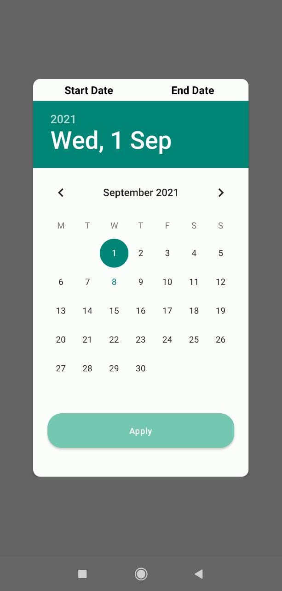

# Chronos
Android library for selecting date or date range
<br>
<br>
## Screenshot 



### Usage
com.github.Codeflicker:Chronos:1.0.0

**Initialise DateSelector**
<br>
```
DateSelector selector = new DateSelector(MainActivity.this).Builder();
                selector.Build(new DateRangeCallback() {
                    @Override
                    public void onDateSelected(long startEpoch, long endEpoch) {

                    }
                });
```                
<br>

**Customization**
<br>
Allow future date selection
```
selector.allowFutureDateSelection(true);
```

Set Button Color
```
selector.setButtonColor(R.color.color_primary);
```


### Import Dependency
com.github.Codeflicker:Chronos:1.0.0


